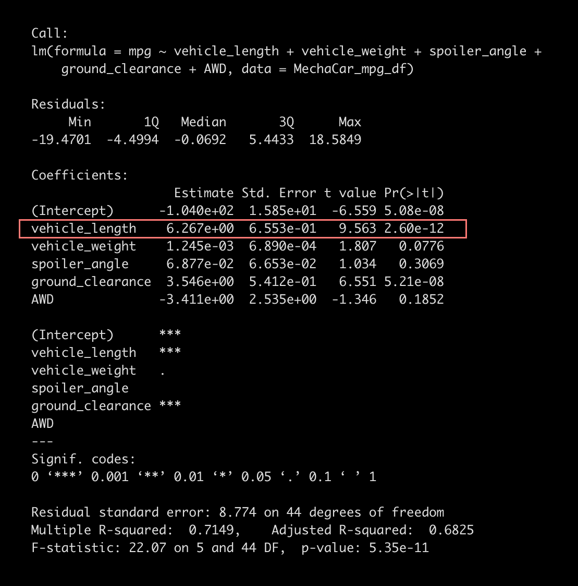

# MechaCar Statistical Analysis

## Part 1: MPG Correlations

For this first analysis, we perform a linear regression on our first data set to see if any variables correlate to increased miles per gallon.

[Source Script Here](https://github.com/carlosjennings1991/MechaCar_Statistical_Analysis/blob/main/MechaCarChallenge.R)
<br>
[Source Data Here](https://github.com/carlosjennings1991/MechaCar_Statistical_Analysis/blob/main/MechaCar_mpg.csv)

Since multiple linear regressions are difficult to visualize, here are all the single multiple regressions. 


As you can see above, none of the slopes are zero, each correlation has some slope, albeit some much more than others. 

The 6 plotted correlations are as follows: 

* Length (in Feet) to MPG
* Weight (in Pounds) to MPG
* Spoiler Angle to MPG
* Clearance Height (in Inches) to MPG
* AWD to MPG
* MPG to MPG (perfect correlation)

For example, length is the greatest predictor of increase in MPG. Somewhat surprisingly, weight is not a great predictor of MPG. 

Now, lets look at the summary statistics for the multiple line regression of all the variables. 



Again, we see that vehicle length has the steepest slope, with every 1 increase in miles per gallon, we have a 6.267e+00 increase in length. 

---
## Part 2: 

For the second analysis, we review the PSI (pounds per square inch) of Suspension Coils from an automanufacturer who produces from 3 different facilities (i.e 'Lots'). On our first pass, we review the data as a whole -undifferentiated by group, and on the second pass we subdivided the data lot origin. 

[Source Data of Suspension Coils Here](https://github.com/carlosjennings1991/MechaCar_Statistical_Analysis/blob/main/Suspension_Coil.csv)


As we can see, the mean and median are closely grouped, with a very small PSI difference between them. We have a standard deviation of 7.89 PSI and raising this figure to the power of 2 gives us our Variance. 

Here is the line of code, written in R, that processed the original source data into our summary: 

```total_summary <- suspension_coil_df %>% summarize(Mean=mean(PSI),Median=median(PSI),Variance=sd(PSI) ** 2,SD=sd(PSI))```


##

Next, we review this data but grouped by origin lot. 


This provides a much more precise picture of what's happening on the ground floor. We can see that Lot 1 performs very well, with a standard deviation with less than 1 PSI. Lot 2 is still pretty good, but the standard deviation is appreciably higher and Lot 3 has a dramatically higher standard deviation and variance. f

Below is the line of code that processed the original source data into our grouped summary. 

```lot_summary <- suspension_coil_df %>% group_by(Manufacturing_Lot) %>% summarize(Mean=mean(PSI),Median=median(PSI),Variance=sd(PSI) ** 2,SD=sd(PSI))```

---
## Part 3: 

For the third analysis, we analyze a sample's PSI against the population as a whole and then analyze each lot's PSI vs the population as a whole. 

The first step (sample vs population) was created through this line of code ```t.test(log10(sample_table$PSI),mu=mean(log10(suspension_coil_df$PSI)))```, and generated the below summary. 


#
The second step, creating a data frame for each lot were created by the following lines of code. 
<br>
```lot1_df <- subset(suspension_coil_df, Manufacturing_Lot=='Lot1')```
<br>
```lot2_df <- subset(suspension_coil_df, Manufacturing_Lot=='Lot2')```
<br>
```lot3_df <- subset(suspension_coil_df, Manufacturing_Lot=='Lot3')```

Then we compare each subset vs the population using these lines of code. 
<br>
```t.test(log10(lot1_df$PSI),mu=mean(log10(suspension_coil_df$PSI)))```
<br>
```t.test(log10(lot2_df$PSI),mu=mean(log10(suspension_coil_df$PSI)))```
<br>
```t.test(log10(lot3_df$PSI),mu=mean(log10(suspension_coil_df$PSI)))```

Here is the first analysis, which focuses on Lot1's PSI vs the Population as a whole. 


Here is the second analysis, which focuses on Lot2's PSI vs the Population as a whole. 


Here is the third analysis, which focuses on Lot3's PSI vs the Population as a whole. 


Based on the three t-tests, we can see that lots 1 and 2 both have high t values and low p values. This weakens the null hypthesis as there is clearly a difference between these two lots and lot three, and we cannot chalk up the differences to random chance - there is clearly something that is negatively affecting the outcomes of lot 3, or conversely, there is clearly something positively affecting the outcomes in lots 1 and 2 (especially lot 1). 

---
## Study Design: MechaCar vs Competition

Total cost of ownership is a crucial conscept for any car driver, and the concept is pretty simple. Purchase price isn't the only cost to consider. One must also factor in maintenance and fuel efficiency to generate a more comprehensive metric known as 'Total Cost of Ownership'. For MechaCar it means positioning their cars as being more cost competitive vs the competition when these additional metrics are considered. 

